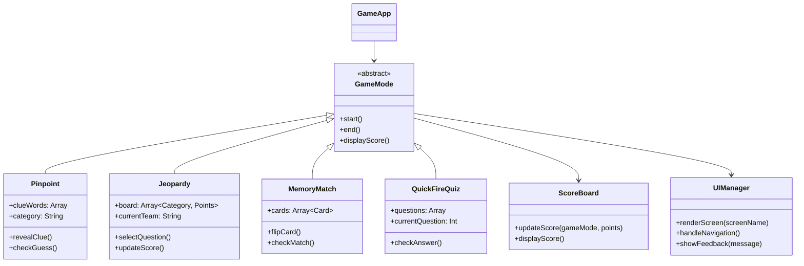

# Addiction Uncovered: UI/UX & Technical Blueprint

## 1. Application Overview

**Purpose:**
"Addiction Uncovered" is an interactive educational app designed to teach users about substance abuse, prevention, and healthy coping strategies. The goal is to engage users without trivializing the topic.

**Target Audience:**
* Teens, young adults, educators, and awareness program participants.
* Users seeking knowledge about addiction facts, myths, and coping skills.

**Educational Goals:**
* Correct myths about addiction
* Raise awareness about substance misuse statistics
* Highlight risk and protective factors
* Encourage support-seeking behavior

## 2. Core Game Modes & UI Components

### A. Pinpoint Game
**Function:** Daily word-association puzzle.
**UI Features:**
* Clean card-style clue word display
* Text input for category guess
* Clue reveal animation after incorrect guess
* Score panel showing streak and accuracy
* Theme switcher (alcohol, cannabis, tobacco, etc.)
**UX Notes:**
* Encourage thought, reflection, and gradual hints
* Provide positive reinforcement when correct

### B. Jeopardy Challenge
**Function:** Classic Jeopardy quiz board.
**UI Features:**
* Grid of clickable tiles with categories and points
* Timer countdown for each team’s turn
* Scoreboard updated live
* Steal mechanic for incorrect answers
* Modal pop-up for questions and feedback
**UX Notes:**
* Responsive grid for mobile
* Clear indicator of active team
* Friendly feedback on right/wrong answers

### C. Memory Match
**Function:** Match cards that connect concepts.
**UI Features:**
* Grid layout of flipped cards
* Flip animation on click
* Matching feedback (success/fail animation)
* Score counter
**UX Notes:**
* Color-coded pairs for accessibility
* Encourage repetition for learning retention

### D. Quick Fire Quiz
**Function:** Rapid true/false questions.
**UI Features:**
* Large, tappable T/F buttons
* Timer countdown bar
* Instant feedback for each answer
* Summary screen with score and accuracy
**UX Notes:**
* Encourage fast recall
* Positive reinforcement for correct answers
* Motivational messages for streaks

## 3. Overall UI/UX Design Guidelines

* **Theme:** Clean, reflective, educational; soft colors, minimal distractions
* **Typography:** Readable sans-serif (e.g., Inter or Poppins)
* **Color Palette:**
  * Background: #F9FAFB (light), #1F2937 (dark mode)
  * Accent: #3B82F6 (blue), #EF4444 (red for mistakes), #10B981 (green for correct)
* **Navigation:** Bottom navigation for mobile; top bar for desktop
* **Responsiveness:** Mobile-first, adaptive grid layouts for games
* **Accessibility:**
  * Alt text for images
  * High-contrast mode
  * ARIA labels for interactive elements

## 4. Front-End Structure / File Template

```
/addiction-uncovered
│
├─ index.html          # Landing page, navigation, and game selection
├─ pinpoint.html       # Pinpoint game interface
├─ jeopardy.html       # Jeopardy challenge interface
├─ memory.html         # Memory match interface
├─ quickfire.html      # Quick fire quiz interface
│
├─ css/
│   └─ tailwind.css    # Tailwind main stylesheet
│
├─ js/
│   ├─ main.js         # Navigation, theme switching, helper functions
│   ├─ pinpoint.js     # Pinpoint game logic
│   ├─ jeopardy.js     # Jeopardy logic
│   ├─ memory.js       # Memory match logic
│   └─ quickfire.js    # Quiz logic
│
└─ assets/
    ├─ images/         # Icons, cards, clue visuals
    └─ sounds/         # Optional sound effects
```

## 5. UML / Component Structure

**UML Class Diagram:**


